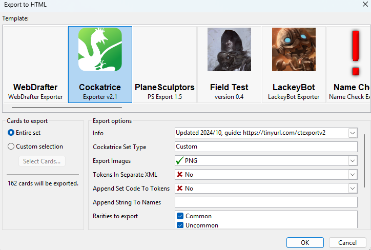

# Installation

## MSE

1. Install it via following the installation in https://github.com/MagicSetEditorPacks/M15-Magic-Pack/?tab=readme-ov-file#installation (tested with version 2.5.6)
2. Open MSE and click open set. Choose the set file in MSE/sets/Chaos Crawl The Fould Realms.mse-set in this repo
3. Enjoy the set within MSE

## Cockatrice

1. Install Cockatrice via https://cockatrice.github.io/ (tested with version 2.10.2)
2. Copy and Replace Cockatrice/data folder with the Cockatrice/data folder in this repo 
3. Start Cockatrice and find the set in the card database

## Forge

# Set Imports

## MSE -> Cockatrice

1. Export from MSE
    - Go to File->Export-> HTML...
    - Use settings as shown in the screenshot: 
2. Prepare/Reformat exported .xml file
    - Use script `TBD` to reformat the exported xml. It will clean every special characters within the name tag to fix the link between xml entry and card image
3. Import to Cockatrice
    - Copy the images into your installation of Cockatrice `Cockatrice/data/pics/CUSTOM/`
    - Copy the cleaned xml file into `Cockatrice/data/customsets`
4. Start Cockatrice and find the set in the card database

## MSE -> Forge

